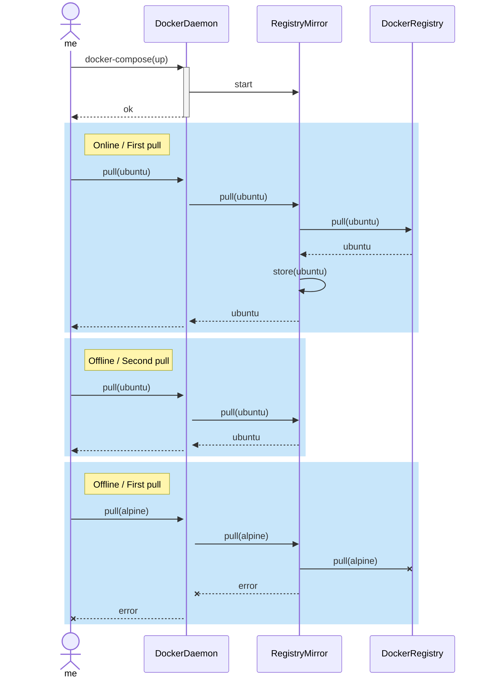

# Docker Registry Local Mirror

## Why I needed it

I recently started working on some personal projects to do and learn things that I had in my TODO list for a very long time.
One the moments when I work on it is during my (long) commuting times when I go to the office or somewhere else by train.
In order to get my docker images I need internet connection provided by my phone and it brings a couple of problems:

- I don't have a large amount of GB per month so I am exhausting my available data pretty soon.
- When I am in tunnels, etc. the connection is dropped.

When docker images are new, there is no way to escape it, but I usually use the same docker images for the same projects. Once they
are downloaded there is no problem but I like keeping the amount of images in my system under control, so I want to be able to do:

```bash
docker rmi -f $(docker images -aq)
```

often.

I thought that if would be cool to have a mirror of the docker registry with the images I use so I can keep running this command and `pull` the images
from my computer.

That's why I decided to try out and add a docker registri mirror in my machine. And it turned out much easier than I expected.

## How it works

<div style={{ display: "none"}}>


</div>


<sub>I did not configure mermaid in my blog yet. I will replace the image with the diagram when it is ready</sub>

## How can you use it

The code and the explanation on how to use it can be found in the [docker-registry-mirror repository](https://github.com/tonitienda/docker-registry-mirror). 


Happy (and low data usage) programming!