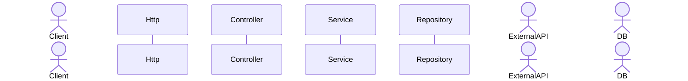

# Function call cascading considered harmful

Increase the reusability and the composability of software components is one of the goals we all have in mind.
But more often than not we fail to do so and we are not sure why.
Other times we feel a given way of implementing something is better than another way without a clear rationale for it and
we sometimes define the differences as mere programing styles.

This is one of those cases. I prefer writing code that reads like recipes and I try to write a function (or in general a component)
as something that will be used by multiple clients even if it not the case yet. But I thought that was my style
and that sometimes made things more complex (in the sense of more moving parts) that there should be.

Recently, during a refactor I notice one of these situations where the code had a different style and I found it
more difficult to reason about, test and reuse. But I still could not find a term or a clear and general rationale
about why I felt that way.

Thinking about it made me realize about where the problem is and, thanks to Chat GPT, I could find the terms for those
different styles.

I will illustrate the problem with an example, so things are more clear and, hopefully, obvious.

## The problem

// TODO - Think of an actual-ish example
We need to implement a REST endpoint that receives a JSON body and we need to:

- Validate the data
- Get data from the DB in order to make sure that the operation is valid.
- Enrich the data by sending a request to another API.
- Store the data in the DB
- Return the ID to the Client

