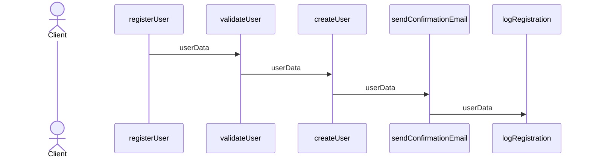
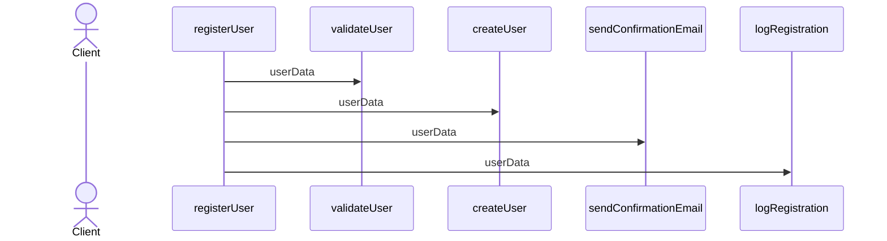
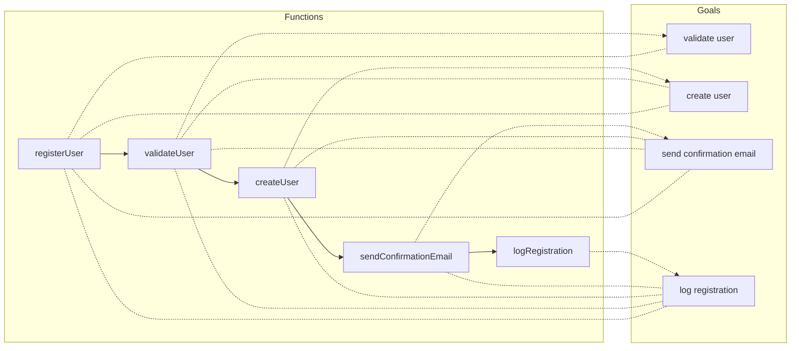
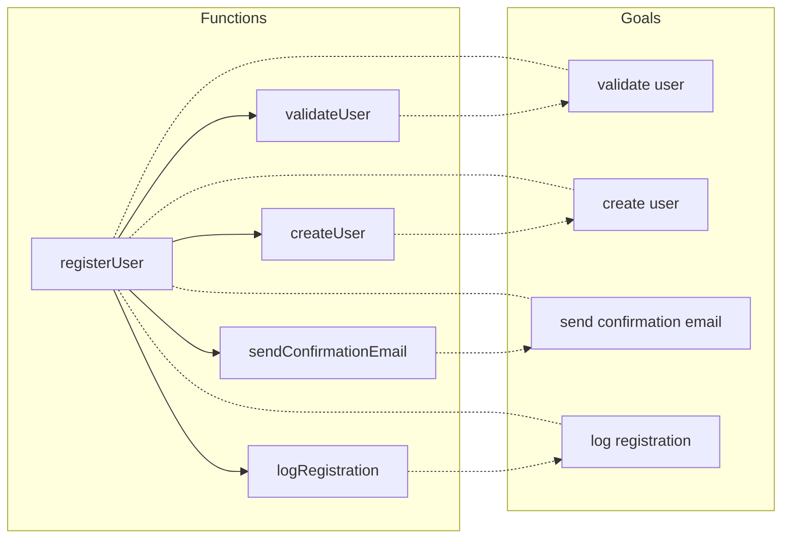

# Function call cascading considered harmful

## Introduction

Improving the reusability and composability of software components is a common goal we all strive for. However, more often than not, we find ourselves falling short without a clear understanding of why. Sometimes, we favor one approach over another without a solid rationale, labeling the differences as mere programming styles.

In my case, I have a preference for writing code that reads like recipes. I strive to develop functions or components as if they will be utilized by multiple clients, even if that's not the current scenario. This personal style offers benefits such as reusability and testability, but I have also realized that it tends to veer toward overengineering, so it's important to keep that in check.

During a recent refactoring process, I encountered a situation where the code followed a different style, and I found it more challenging to reason about, test, and reuse. Yet, I couldn't pinpoint a specific term or a clear, general rationale to explain why I felt that way.

Upon reflection, I discovered the root of the problem, and with the help of Chat GPT, I uncovered the terms associated with those distinct styles.

To illustrate the problem clearly and make it more apparent, I will provide an example.

## The problem

Consider a web application that processes user registrations. When a new user signs up, various tasks need to be performed, such as validating the user's data, creating a user account, sending a confirmation email, and logging the registration event.

### Function call cascading

One way of implementing this functionality is using function call cascading.
We can visualize it as a sequence:



And the code would look like:

```javascript
function registerUser(userData) {
  validateUser(userData);
}

function validateUser(userData) {
  if (userData.username && userData.email && userData.password) {
    createUser(userData);
  } else {
    console.log("Invalid user data.");
  }
}

function createUser(userData) {
  // Logic to create a user account

  sendConfirmationEmail(userData);
}

function sendConfirmationEmail(userData) {
  // Logic to send a confirmation email

  logRegistration(userData);
}

function logRegistration(userData) {
  // Logic to log the registration event

  console.log("User registration completed.");
}
```

The code will run in sequence, one function after another. If one function fails the next
one will not be executed.

From a functional point of view, this works as expected and `registerUser` will do what
it is intended to.

### Function Orchestration

> Function orchestration: a component organizes and decides the order and need to execute a given set
> of functions. (I had some troubles naming this style. Let me know if there are better / existing names)

Another way to implement the same functionality is to use a recipe-like sequence of functions
to be executed.

As a sequence it would look like:



And this is the code:

```javascript
function registerUser(userData) {
  if (validateUser(userData)) {
    createUser(userData);
    sendConfirmationEmail(userData);
    logRegistration(userData);
    console.log("User registration completed.");
  } else {
    console.log("Invalid user data.");
  }
}

function validateUser(userData) {
  return userData.username && userData.email && userData.password;
}

function createUser(userData) {
  // Logic to create a user account
}

function sendConfirmationEmail(userData) {
  // Logic to send a confirmation email
}

function logRegistration(userData) {
  // Logic to log the registration event
}
```

## Analysis

Although the example is very basic and might be obvious that something is off in the first example,
I have seen this style in multiple projects I have worked on. Usually hidden in complex logic.

In the following subsections you can find some of the reasons why the second approach should be preferred.

### Objective coupling

When employing function call cascading, all functions become tightly coupled to the objectives of the functions they call down the line.

For instance, let's consider the `registerUser` function with the following goals:

- Validate user
- Create user
- Send confirmation email
- Log registration

In this case, the `validateUser` function will **inherit** the same goals as `registerUser`. Similarly, the `createUser` function will inherit all goals except for the validation of the user, and so on.





This means that I cannot use any of the intermediate functions in a different context than the one aimed at achieving all those goals.

I intentionally use the term **inherit** because the problem is reminiscent of the issues that arise when using inheritance for code reusability.

### Single responsibility

In line with the issue of objective coupling, every function that calls another function becomes coupled with the responsibilities of the subsequent function. While this coupling may make sense in some cases, such as the `registerUser` function being responsible for all the effects (storing in a database, sending emails, etc.) related to user registration, even if it delegates each effect to a specific function.

On the other hand, the `validateUser` function should solely be responsible for user validation. However, by utilizing function call cascading, we inadvertently introduce the responsibility of creating a user, sending emails, and so on.

### Testing

When conducting integration testing on the `registerUser` function (or any other top-level entry point), it becomes necessary to mock the entire I/O environment to ensure

correct behavior. However, it would be preferable to conduct unit tests on the individual composed functions in isolation.

As a result of the objective and responsibility coupling, when function call cascading is used, we find ourselves obligated to mock the environment for testing each of the composed functions as well.

> It's worth noting that certain languages, like Python with pytest fixtures, provide mechanisms that facilitate the mocking of intermediate functions.

## Conclusion

In general, to enhance code reusability, testability, readability, and more, it is crucial to be self-conscious when encountering deep function call cascades.
Take a moment to consider whether the flow you are attempting to describe could be flattened and written as a recipe instead.
I firmly believe that by keeping a vigilant eye on this aspect, we can improve both our code and our overall development experiences.

### But...

As most (interesting and fun) things in software, decisions on what is best depends on the context of the decision
and creating general rules is oversimplistic.

As a counter example of my own post, there are some patterns that promote the use of function call cascading while
maintaining the flexibility of the system.
For example when we use [Chain of responsibility](https://refactoring.guru/design-patterns/chain-of-responsibility) like
in middlewares, each middleware will call the next. But each of them are unaware of what middleware is next since
that decision is taken in another component, and therefore the middlewares can be plugged together in any way.
