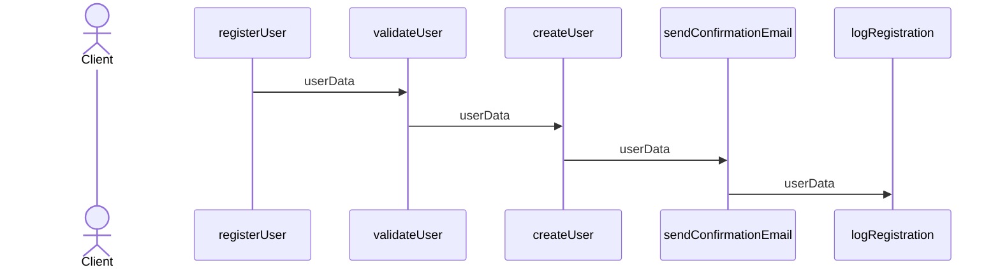
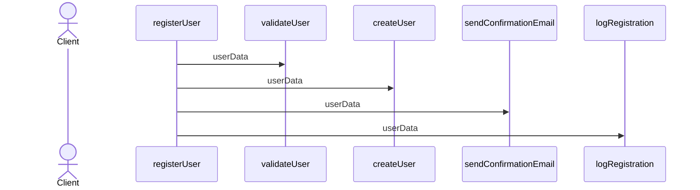
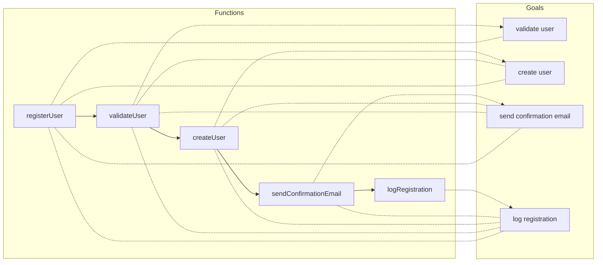
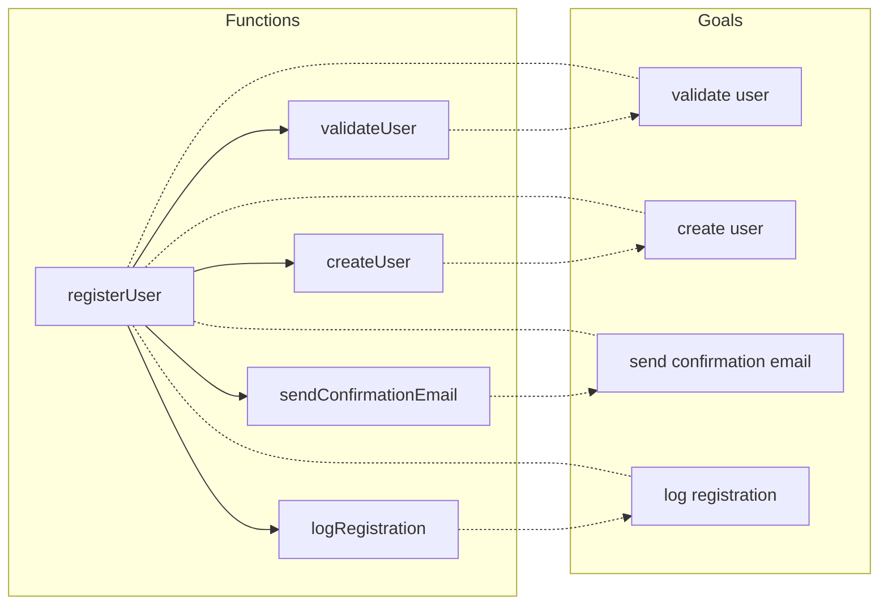

# Function call cascading considered harmful

## Introduction

Improving the reusability and composability of software components is a common goal we all strive for.
However, more often than not, we find ourselves falling short without a clear understanding of why.
Sometimes, we favor one approach over another without a solid rationale, labeling the differences as
mere programming styles.

In my case, I have a preference for writing code that reads like recipes. I strive to develop functions
or components as if they will be utilized by multiple clients, even if that's not the current scenario.
This personal style offers benefits such as reusability and testability, but I have also realized that it
tends to veer toward overengineering, so it's important to keep that in check.

During a recent refactoring process, I encountered a situation where the code followed a different style,
and I found it more challenging to reason about, test, and reuse. Yet, I couldn't pinpoint a specific
term or a clear, general rationale to explain why I felt that way.

Upon reflection, I discovered the root of the problem, and with the help of Chat GPT, I uncovered the
terms associated with those distinct styles.

To illustrate the problem clearly and make it more apparent, I will provide an example.

## The problem

Consider a web application that processes user registrations. When a new user signs up, various tasks need to be performed, such as validating the user's data, creating a user account, sending a confirmation email, and logging the registration event.

### Function call cascading

One way of implementing this functionality using function call cascading:



```javascript
function registerUser(userData) {
  validateUser(userData);
}

function validateUser(userData) {
  if (userData.username && userData.email && userData.password) {
    createUser(userData);
  } else {
    console.log("Invalid user data.");
  }
}

function createUser(userData) {
  // Logic to create a user account

  sendConfirmationEmail(userData);
}

function sendConfirmationEmail(userData) {
  // Logic to send a confirmation email

  logRegistration(userData);
}

function logRegistration(userData) {
  // Logic to log the registration event

  console.log("User registration completed.");
}
```

Although this example with simplified code might seem strange and obvious, we often use this pattern and make functions call
the next function in the sequence.

### Recipe - Composition

The other way is using a recipe-like expression:



```javascript
function registerUser(userData) {
  if (validateUser(userData)) {
    createUser(userData);
    sendConfirmationEmail(userData);
    logRegistration(userData);
    console.log("User registration completed.");
  } else {
    console.log("Invalid user data.");
  }
}

function validateUser(userData) {
  return userData.username && userData.email && userData.password;
}

function createUser(userData) {
  // Logic to create a user account
}

function sendConfirmationEmail(userData) {
  // Logic to send a confirmation email
}

function logRegistration(userData) {
  // Logic to log the registration event
}
```

## Analysis

### Goal coupling

When using function call cascading, all functions are coupled to the goal of the functions that
are called down the line.

For example, if registerUser has the goals:

- validate user
- create user
- send confirmation email
- log registration

`validateUser` will **inherit** the same goals. `createUser` will inherit all goals except validate user, etc.





That means that I cannot use any of the intermediate functions in a different context that the one aiming to achieve all
those goals.

I use **inherit** on purpose because the problem is similar to the one that arises when using inheritance for
code reusability.

### Single responsibility

In the same line of the Goal coupling, every function that calls another function is coupling its own responsibility
with the next one. In some case it makes sense. For example, `registerUser` is the final responsible for all the effects
(store in DB, send email, etc) related to registering a user even if it delegates each one to a specific function.

`validateUser` should have the only responsibility of validating a user, but, by using function call cascading we are
indirectly adding the responsibility of creating user, sending an email, etc.

### Testing

Function call cascading also impacts the testing of the functions.
When testing `registerUser` I might want to mock all the environment to make sure that the I/O
is correct, but I should be able to test the rest of functions in isolation.

By using function call cascading we are forced to mock the environment for testing each single function.

> A disclaimer here is that some languages make it easier to mock intermediate functions (like python with pytest fixtures).
